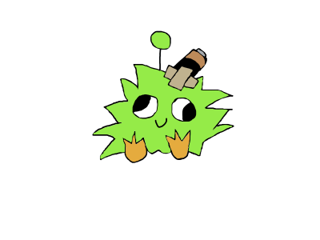

# 🐾 Pawsse - Virtual Pet

A cute virtual pet desktop application built with Rust and Macroquad. Take care of your pet by petting it regularly, or watch it get sad over time!



## 📖 About

Pawsse is a simple virtual pet game where you need to take care of a pet by clicking on it to pet it. The pet has three emotional states:
- 😊 **Happy** - When well taken care of
- 😐 **Serious** - When it needs attention
- 😢 **Sad** - When neglected for too long

## ✨ Features

- **Animated Background** - Smooth background animation
- **Pet States** - Three emotional states that change based on time and care
- **Petting System** - Click to pet your pet with cute animations
- **Progress System** - 
  - From **Sad** to **Serious**: Requires 3 pets
  - From **Serious** to **Happy**: Requires 2 pets
- **Persistent Data** - Your total pet count is saved automatically
- **Customizable Window** - Fixed size window (400x300) that stays on your desktop

## 🚀 Getting Started

### Prerequisites

- [Rust](https://www.rust-lang.org/tools/install) (latest stable version)
- Cargo (comes with Rust)

### Installation

1. Clone this repository:
```bash
git clone https://github.com/Julio0Cesar/Pawse
cd pawse
```

2. Build and run:
```bash
cargo run
```

## 🎮 How to Play

1. The pet starts in a **Happy** state
2. Over time, if not petted, the pet will become **Serious** and then **Sad**
3. Click on the pet to pet it - this triggers a cute animation
4. Pet your pet enough times to improve its mood:
   - **Sad** → **Serious**: 3 pets needed
   - **Serious** → **Happy**: 2 pets needed
5. Your total pet count is tracked and saved automatically

## 🛠️ Technology Stack

- **Rust** - Systems programming language
- **Macroquad** - Game framework for 2D graphics
- **Serde** - Serialization framework for save data
- **Serde JSON** - JSON serialization

## 📁 Project Structure

```
pawse/
├── assets/          # Game assets (images, sprites)
│   └── 400x300/     # Assets for 400x300 resolution
├── data/            # Save data directory
│   └── save_data.json
├── src/
│   └── main.rs      # Main game logic
├── Cargo.toml       # Project dependencies
└── README.md        # This file
```

## 🎨 Assets

The game uses custom art assets:
- Pet states: `paw_happy.png`, `paw_serious.png`, `paw_sad.png`
- Petting animations: `hand_paw_*_1.png`, `hand_paw_*_2.png`
- Background: `background_1.png`, `background_2.png` (animated)

## 💾 Save Data

Your progress is automatically saved to `data/save_data.json`. The file stores:
- Total number of times you've petted your pet

## 🔧 Configuration

Window settings can be modified in `src/main.rs` in the `window_conf()` function:
- Window size: 400x300 pixels
- Window title: "Pawsse - Virtual Pet"
- Resizable: Disabled

Made with ❤️ and Rust 🦀
